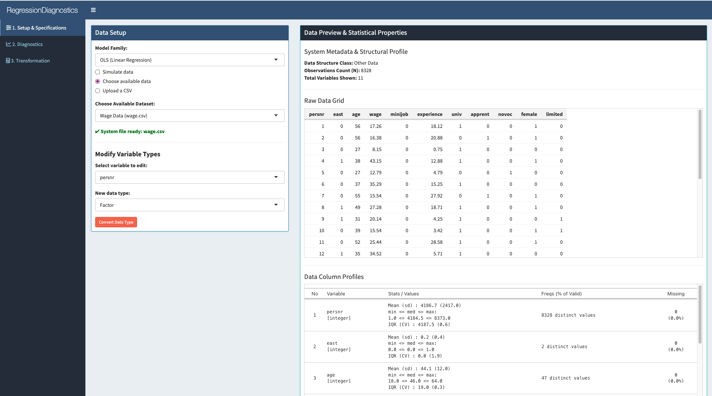
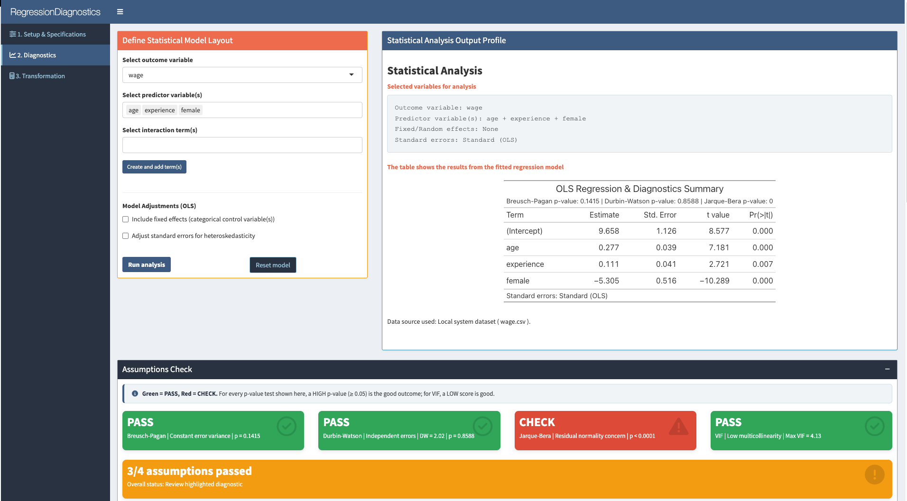
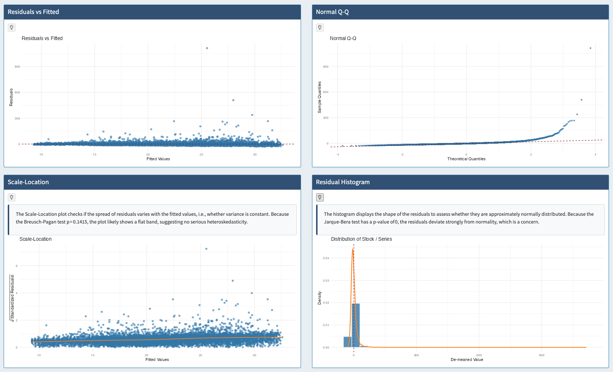
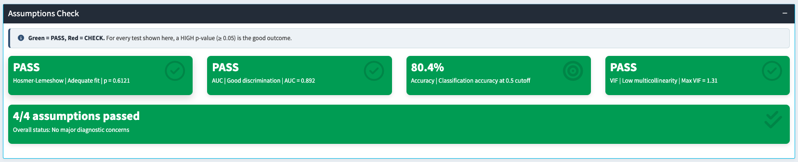
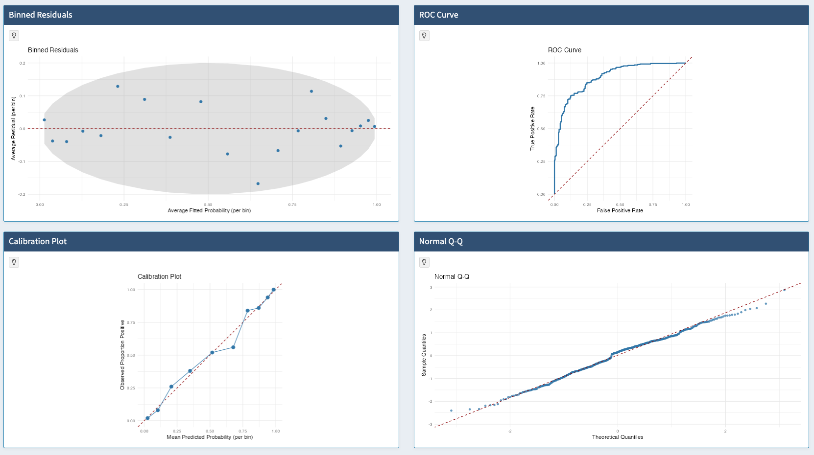
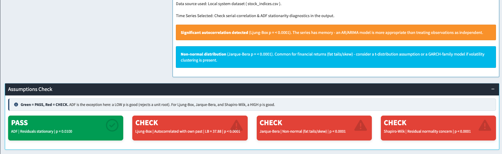
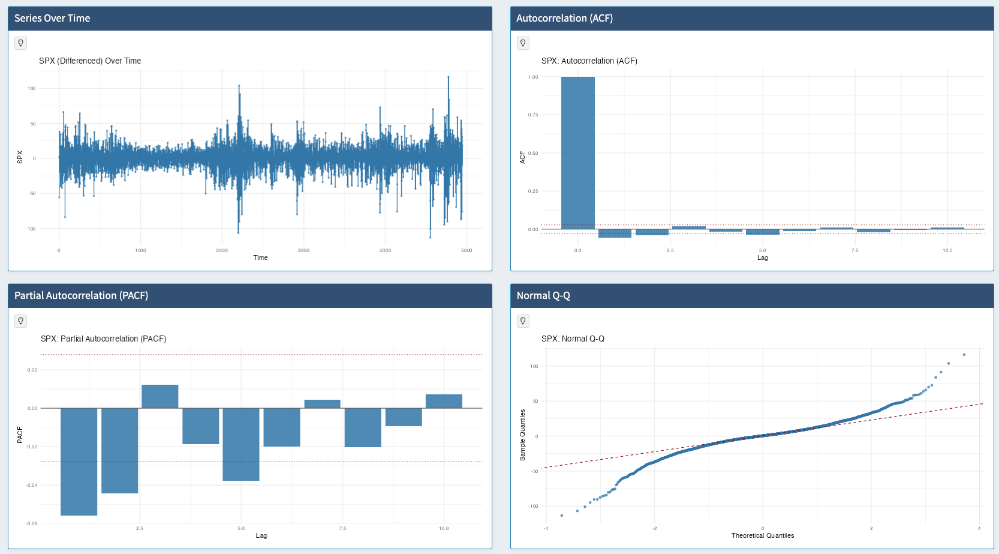
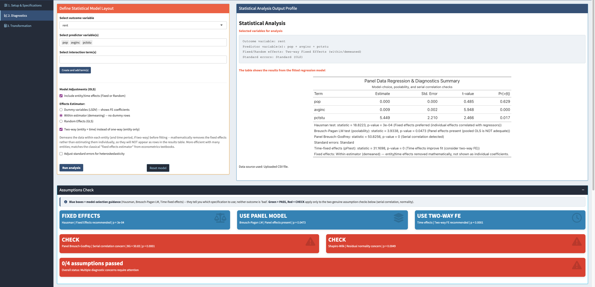
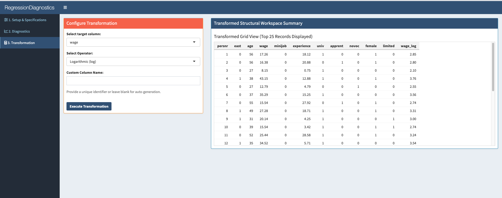
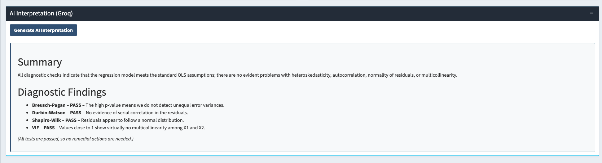

```{r setup, include=FALSE}
knitr::opts_chunk$set(
  echo = TRUE,
  message = FALSE,
  warning = FALSE,
  fig.align = "center",
  fig.width = 5,
  fig.height = 3.6,
  out.width = "70%",
  size="small"
)

# Paths are anchored to the project root via here::here() rather than
# relative paths, so knitting is invocation-context-independent (works from
# RStudio, rmarkdown::render(), or a CI pipeline regardless of working
# directory).
library(here)
here::i_am("report/report.Rmd")
library(ggplot2)
library(dplyr)
library(car)
library(lmtest)
library(plm)
library(knitr)
library(kableExtra)

source(here::here("R", "diag_lm_class.R"))
source(here::here("R", "simulate_data.R"))
```


# Introduction

## Motivation

Linear regression remains a foundational statistical method for examining relationships between outcomes and predictor variables. The Classical Linear Regression Model (CLRM) estimated by Ordinary Least Squares (OLS) relies on a small set of Gauss--Markov assumptions (linearity, strict exogeneity, homoskedasticity, no serial correlation and no perfect multicollinearity) for its estimator to be the Best Linear Unbiased Estimator (BLUE), and on normality of the errors for small-sample inference (t- and F-tests) to be exact [@gujarati2009; @wooldridge2020]. In applied work, violations of these assumptions are common and, if undetected, can lead to inefficient estimates, biased standard errors and misleading hypothesis tests. Manually checking each assumption for every model specification is repetitive and error-prone, which motivates encapsulating the checks inside a reusable software abstraction.

## Objectives

This project has four objectives:

1. **Encapsulate diagnostic logic** in a single, well-tested S3 class (`diag_lm`) that separates statistical computation from presentation, following the classic R idiom of `print`/`summary`/`plot` methods (Section 2).
2. **Extend the diagnostic framework beyond the linear model** to binomial logistic regression (a distinct toolkit of goodness-of-fit, discrimination and calibration checks; Section 3.5) and to univariate time-series stationarity checking via the Augmented Dickey--Fuller test, ACF and PACF (Section 3.6).
3. **Provide an interactive front end** (`app.R`, a `shiny` dashboard) so a non-technical user can choose a model family, simulate data with known assumption violations or upload their own, and see immediately whether an assumption is violated, through a display curated to the model family and data structure selected (Sections 2.4 and 5).
4. **Validate the implementation** through (a) a controlled simulation study with known ground truth for both model families, (b) applied case studies on real survey data and (c) an automated regression test suite (Section 7).

## Report Roadmap

Section 2 describes the software architecture. Section 3 reviews the statistical methodology behind each diagnostic test, for three model families. Section 4 presents the simulation study. Section 5 documents the `shiny` application. Section 6 presents real-world case studies. Section 7 summarises automated testing and validation. Section 8 discusses limitations and future work, and Section 9 concludes. Appendix A describes the variables used in the report's real and simulated datasets, and Appendix B provides the vignette-style usage guide.

# Software Architecture

## Project Structure

The project is organised as a set of R scripts rather than a formally installable package (there is no `DESCRIPTION` or `NAMESPACE` file). The layout is:

```{=latex}
\footnotesize
```
```
Project/
+-- app.R                  # Shiny app (UI + server), the sole application
+-- R/
|   +-- diag_lm_class.R    # diag_lm S3 class: constructor, print/summary/plot
|   +-- simulate_data.R    # simulate_ols/ts/logit/panel_data()
|   +-- llm_interpret.R    # optional AI-assisted interpretation via Groq (Sec 5.2)
+-- data/
|   +-- sample_cars.csv, wage.csv, stock_indices.csv, titanic.csv, srental.csv
+-- tests/
|   +-- test_diag_lm.R        # unit tests for diag_lm (linear, logistic, time-series)
|   +-- test_llm_interpret.R  # prompt formatting & offline fallback tests for LLM layer
|   +-- test_app_server.R     # shiny::testServer() integration tests for app.R
+-- report/
    +-- report.Rmd        # this report (rmarkdown source)
    +-- references.bib     # bibliography
    +-- figures/           # screenshots used in Section 5
```
```{=latex}
\normalsize
```
Because the project comprises scripts rather than a package, the documentation normally provided by a vignette is instead given narratively throughout this report and, in full tutorial form, in Appendix B.

## The `diag_lm` S3 Class

`diag_lm` is a lightweight container class built with R's S3 object system. The constructor, `new_diag_lm(model, data_type)`, accepts a fitted `lm`, `plm` or binomial `glm` object and:

1. validates the input against the requested `data_type`: `"logistic"` (alias `"binary"`) requires a `glm(family = binomial(...))` object, while `"cross-section"`, `"time-series"` and `"panel"` require an `lm`/`plm` object, stopping early with an informative error otherwise;
2. stores the model formula, coefficient table, residuals and fitted values;
3. for linear models, computes (each wrapped in `tryCatch()` so failures degrade to `NA` rather than crashing the app) the Breusch--Pagan statistic (`lmtest::bptest`), the Durbin--Watson statistic (`lmtest::dwtest`), the Shapiro--Wilk statistic (`shapiro.test`) and the Variance Inflation Factors (`car::vif`; undefined for single-predictor models);
4. for logistic models, computes instead the Hosmer--Lemeshow goodness-of-fit test, McFadden/Cox--Snell/Nagelkerke pseudo-$R^2$ measures, the AUC, confusion-matrix accuracy/sensitivity/specificity and a (quasi-)complete-separation flag, all implemented in base R (no additional package dependency) to keep the framework lightweight;
5. for time-series models, additionally computes the Augmented Dickey--Fuller unit-root test and the Breusch--Godfrey and Ljung--Box tests for residual serial correlation;
6. for panel models, additionally computes the panel Breusch--Pagan (Lagrange Multiplier) test for panel effects, the Hausman test comparing fixed- and random-effects refits, and a panel Breusch--Godfrey test for serial correlation.

Beyond `new_diag_lm()`, the framework also provides `new_diag_lm_univariate(series, time_index = NULL, var_name = "Series", max_lag = NULL, difference = FALSE)` for diagnosing a single time series directly, via ADF, ACF and PACF, to evaluate serial dependence and prepare the series for AR/ARIMA modelling.

Table 1 summarises the public interface.

```{r s3-methods-table, echo=FALSE}
methods_tbl <- data.frame(
  Function = c("new_diag_lm(model, data_type)",
               "print.diag_lm(x)",
               "summary.diag_lm(object)",
               "plot.diag_lm(x, type)",
               "remediation_advice(object)",
               "new_diag_lm_univariate(series,...)",
               "summary.diag_lm_uni(object)"),
  Returns = c("diag_lm object", "console text", "gt table",
              "ggplot object", "character vector (HTML)",
              "diag_lm_uni object", "gt table"),
  Purpose = c(
    "Constructor: validates input, fits the appropriate diagnostics",
    "Compact console overview of formula, coefficients, diagnostics",
    "Formatted table adapted to cross-section / time-series / panel / logistic layout",
    "One of residuals, qq, scale_location, histogram, acf, pacf, residuals_time (linear); binned_residuals, roc, calibration (logistic)",
    "Rule-based, p-value-driven remediation messages",
    "Constructor for a single time series: ACF/PACF, Ljung-Box, ADF and normality diagnostics",
    "Stationarity/autocorrelation summary table for a diag_lm_uni object"
  )
)
kbl(methods_tbl, caption = "Public interface of the diag\\_lm class",
    booktabs = TRUE, linesep = "") |>
  kable_styling(latex_options = c("hold_position"), font_size = 9) |>
  column_spec(1, width = "4.8cm") |>
  column_spec(2, width = "2.6cm") |>
  column_spec(3, width = "7.6cm")
```
## The Simulation Engine

`R/simulate_data.R` provides four data-generating processes used throughout this report and inside the `shiny` app itself:

- `simulate_ols_data(n, heteroskedastic, multicollinear, non_normal, seed)` draws a cross-sectional sample from
  $$Y_i = 10 + 2.5\,X_{1i} - 1.5\,X_{2i} + \varepsilon_i,$$
  with three independently switchable violations: `heteroskedastic` scales $\mathrm{sd}(\varepsilon_i) = 1 + 1.5|X_{1i}|$; `multicollinear` sets $X_{2i} = X_{1i} + \eta_i$ with small $\eta_i$; and `non_normal` draws $\varepsilon_i$ from a heavy-tailed $t_3$ distribution instead of Gaussian noise -- without it, residuals are always Gaussian by construction and the Shapiro-Wilk/Jarque-Bera check has no way to ever fail.
- `simulate_ts_data(n, heteroskedastic, multicollinear, unit_root, seed, phi)` generates the same linear model with AR(1)-persistent predictors and an AR(1) error process $e_t = \phi e_{t-1} + \nu_t$, inducing genuine serial correlation for the time-series diagnostics to detect. Setting `unit_root = TRUE` replaces the stationary predictor and error processes with genuine random walks ($\phi$ fixed at 1), the analogous mechanism for letting the Augmented Dickey-Fuller check actually show CHECK rather than always rejecting the unit-root null.
- `simulate_logit_data(n, multicollinear, nonlinear, imbalance, seed)` draws a binary outcome from
  $$Y_i \sim \text{Bernoulli}\big(\operatorname{logit}^{-1}(\eta_i)\big), \qquad
    \eta_i = 1.4\,X_{1i} - 1.1\,X_{2i},$$
  with three optional violations: `multicollinear` correlates $X_2$ with $X_1$; `nonlinear` adds an omitted $0.6\,X_1^2$ term to $\eta_i$ so the fitted linear-in-the-logit model is mis-specified; and `imbalance` shifts the intercept to produce a rare positive class ($\approx 10\%$).
- `simulate_panel_data(n_entities, n_periods, correlated_effects, serial_correlation, heteroskedastic, seed)` generates a balanced panel ($Y = 5 + \alpha_i + 2X + e$) with a true entity-level effect $\alpha_i$. `correlated_effects` is the key switch for the Hausman test: when TRUE, $\alpha_i$ is constructed to correlate with each entity's mean $X$ (the condition under which Random Effects becomes inconsistent, so Hausman should favour Fixed Effects); when FALSE, $\alpha_i$ is independent of $X$, so Random Effects remains consistent and Hausman should not reject it. `serial_correlation` optionally makes the errors AR(1) within each entity (independent across entities), giving the panel Breusch-Godfrey test something genuine to detect. Column names (`entity`, `year`) are chosen deliberately so the app's index-guessing logic picks them up automatically.

## The Shiny Application

`app.R` is the sole application in the project. Its server function keeps almost no statistical logic of its own: it maps UI inputs -- including a **Model Family** selector with three values, `linear` (OLS), `logistic` (Binomial), and `ts` (Univariate Time Series) -- to `simulate_ols_data()`, `simulate_ts_data()`, `simulate_logit_data()`, or `simulate_panel_data()` (chosen by data source, model family, and data structure together), a bundled "available" dataset, or an uploaded CSV. For the `linear` and `logistic` families it builds a model formula from the selected outcome/predictor columns (optionally with interaction terms, or an LSDV specification for panel data), fits `lm()`, `plm()`, or `glm(family = binomial())` accordingly, and wraps the result in `new_diag_lm()`. Selecting `ts` takes a different path: rather than fitting a regression, the app reads a single numeric column directly from the current data and hands it to `new_diag_lm_univariate()`, diagnosing the series against its own history instead of against other predictors -- a deliberate simplification, since a genuine regression on time-ordered data remains available by choosing `linear` with a Time-Series data structure. Either path's result is rendered through the same `summary()`/`plot()` outputs.

Two architectural points deserve emphasis (the resulting UI is illustrated with screenshots in Section 5):

- **Family- and structure-aware rendering.** The "Assumptions Check" value boxes and the diagnostic-plot grid are generated by `renderUI()` functions that inspect the selected model family and data structure and render only the diagnostics that are statistically meaningful for that combination; the statistical rationale is given in Section 3.2, and a dedicated violation toggle exists in the Setup tab for every diagnostic the app can show (e.g. `nonnormal_viol`, `unitroot_viol`, `panel_correlated_effects`, `panel_serial_viol`), since without them the corresponding tests would never have a genuine violation to detect.
- **Reactive control.** `eventReactive(input$sim_btn, ..., ignoreNULL = FALSE)` regenerates simulated data only when the user clicks "Simulate & Load Framework" (so dragging the sample-size slider does not silently refit the model), while `ignoreNULL = FALSE` ensures the app is populated on first load. `req()` guards and `validate(need(...))` messages turn missing-input and malformed-CSV situations into friendly in-app messages instead of red Shiny error tracebacks.


# Statistical Methodology

This section summarises the theory behind each diagnostic implemented in `diag_lm`.

## Heteroskedasticity: The Breusch--Pagan Test

The CLRM assumes constant error variance, $\mathrm{Var}(\varepsilon_i) = \sigma^2$ for all $i$. The Breusch--Pagan test [@breuschpagan1979] regresses the squared OLS residuals on the original regressors and tests whether they explain any of the variation in $\hat\varepsilon_i^2$:
$$\hat\varepsilon_i^2 = \gamma_0 + \gamma_1 X_{1i} + \dots + \gamma_k X_{ki} + v_i.$$
The test statistic is $BP = n R^2_{\text{aux}}$, asymptotically $\chi^2_k$ under the null of homoskedasticity. A small p-value ($< 0.05$) is evidence of heteroskedasticity, which leaves $\hat\beta$ unbiased and consistent but no longer BLUE, and invalidates the usual OLS standard errors [@ChrisBrooks2019]. Two remedies are standard: (i) log-transforming the variables, which rescales the data and mitigates outliers but is unavailable with negative values, or (ii) heteroskedasticity-robust ("White") standard errors, which -- when error variance is positively related to the square of a regressor -- widen the slope coefficients' standard errors relative to OLS, making hypothesis tests more conservative [@ChrisBrooks2019].

## Serial Correlation: Durbin--Watson, Breusch--Godfrey and Ljung--Box

For cross-sectional data, `diag_lm` reports the Durbin--Watson statistic [@durbinwatson1950; @durbinwatson1951],
$$DW = \frac{\sum_{t=2}^{n}(\hat\varepsilon_t - \hat\varepsilon_{t-1})^2}{\sum_{t=1}^{n}\hat\varepsilon_t^2} \approx 2(1-\hat\rho),$$
where $\hat\rho$ is the estimated first-order autocorrelation of the residuals; $DW \approx 2$ indicates no serial correlation. For time-series data, `diag_lm` additionally reports the Breusch--Godfrey test [@godfrey1978], which generalises Durbin--Watson to higher-order autocorrelation and remains valid with lagged dependent variables, and the Ljung--Box portmanteau test [@ljungbox1978] on the residual autocorrelation function.

**Why the diagnostic plots differ for time series.** Residuals-vs-Fitted and Scale-Location are constructed against the fitted value and reveal heteroskedasticity or non-linearity; neither can display serial structure, since that structure is indexed by time, not by the fitted value. `diag_lm` therefore also offers a Residuals-over-Time plot (the direct visual analogue of the Breusch--Godfrey and Ljung--Box tests) and a PACF plot alongside the standard ACF plot, so the order of any remaining autocorrelation can be read off directly. `app.R` (Section 6) surfaces exactly this curated set -- Residuals-over-Time, ACF, PACF, Normal Q-Q and Residual Histogram -- for time-series data, rather than reusing the cross-sectional plot menu.

**A caveat on residual-based unit-root testing.** When the `linear` model family is combined with a Time-Series data structure (e.g. regressing one stock index on others, as in the app's `stock_indices.csv` example), `diag_lm` runs the Augmented Dickey--Fuller test on the fitted regression's *residuals* rather than a raw series. This is precisely the Engle--Granger cointegration setup, whose correct critical values are those Engle and Granger derived for regression residuals, not the standard MacKinnon table used by `tseries::adf.test()`. Applying generic ADF critical values to estimated residuals is known to over-reject the unit-root null, creating false confidence that a regression between two integrated series is not spurious. The residual-based ADF check inside `diag_lm` should therefore be read as an indicative signal rather than a formally valid cointegration test. A user who suspects both the outcome and a predictor may be non-stationary is better served by first diagnosing each series individually through the univariate pathway (Section 3.6) before regressing one on the other.

## Normality: The Shapiro--Wilk Test, Bera-Jarque Test

Small-sample $t$/$F$ inference relies on normally distributed errors. The Shapiro--Wilk test [@shapirowilk1965] compares the ordered residuals against the order statistics expected under normality; a small p-value rejects normality. Coefficient estimates remain unbiased under non-normality (Gauss--Markov does not require it), but small-sample hypothesis tests become unreliable.

The Jarque--Bera test is an asymptotic normality test based on skewness ($b_1$, zero under normality) and kurtosis ($b_2$, three under normality):
$$b_1 = \frac{E[u^3]}{(\sigma^2)^{3/2}}, \qquad b_2 = \frac{E[u^4]}{(\sigma^2)^2}, \qquad
W = T \left[ \frac{b_1^2}{6} + \frac{(b_2 - 3)^2}{24} \right].$$
This test substitutes for large sample sizes ($n > 5000$), where `shapiro.test()` cannot be applied due to its built-in sample-size restriction [@ChrisBrooks2019]. Log-transforming a strongly right-skewed dependent variable can move the residual distribution closer to normal.

## Multicollinearity: The Variance Inflation Factor

Multicollinearity inflates the variance of $\hat\beta_j$ without biasing it. The Variance Inflation Factor for predictor $j$ [@foxweisberg2019] is
$$VIF_j = \frac{1}{1 - R_j^2},$$
where $R_j^2$ is the $R^2$ from regressing $X_j$ on all other predictors. $VIF_j \approx 1$ indicates no collinearity; a common rule of thumb flags $VIF_j > 5$ (or 10) as problematic, and it is undefined for single-predictor models, so `new_diag_lm()` returns `NA` rather than raising an error. Near multicollinearity keeps $R^2$ high while individual coefficients acquire large standard errors, so the regression "looks good" overall even though no single predictor is significant; the fit also becomes unstable, with small specification changes causing erratic shifts in the remaining coefficients, wider confidence intervals and unreliable significance tests. The two standard remedies are dropping one of the collinear variables or combining them into a single predictor [@GaraithJames2021].

## Logistic Regression Diagnostics

A binary outcome violates the assumptions Breusch--Pagan, Durbin--Watson and Shapiro--Wilk are built on: the response is not continuous, its conditional variance is $p_i(1-p_i)$ rather than a constant $\sigma^2$, and its residuals are never normally distributed. When `data_type = "logistic"`, `diag_lm` substitutes a different toolkit, all implemented in base R.

**Goodness-of-fit: the Hosmer--Lemeshow test.** [@hosmerlemeshow1980; @hosmerlemeshow2013] groups observations into $g$ (here $g=10$) bins of increasing predicted probability and compares observed versus expected successes and failures within each bin:
$$HL = \sum_{k=1}^{g} \left[ \frac{(O_{1k}-E_{1k})^2}{E_{1k}} + \frac{(O_{0k}-E_{0k})^2}{E_{0k}} \right],$$
asymptotically $\chi^2_{g-2}$ under the null that the fitted model is correctly specified. A small p-value indicates poor fit, typically a sign of omitted non-linearity or missing predictors.

**Pseudo-$R^2$ measures.** Because logistic regression is fit by maximum likelihood, no direct OLS-$R^2$ analogue exists. `diag_lm` reports three approximations from the fitted log-likelihood $\ell_{\text{model}}$ and the intercept-only null log-likelihood $\ell_{\text{null}}$: McFadden's [@mcfadden1974] $R^2_{\text{McF}} = 1 - \ell_{\text{model}}/\ell_{\text{null}}$; Cox--Snell's [@coxsnell1989] $R^2_{\text{CS}} = 1 - \exp\{(2/n)(\ell_{\text{null}}-\ell_{\text{model}})\}$; and Nagelkerke's [@nagelkerke1991] rescaled $R^2_{\text{Nag}} = R^2_{\text{CS}} / (1 - \exp\{(2/n)\ell_{\text{null}}\})$, which stretches $R^2_{\text{CS}}$ so it can reach 1.

**Discrimination: the ROC curve and AUC.** The Area Under the ROC curve [@hanleymcneil1982] summarises how well the fitted probabilities separate the two classes across every decision threshold; `diag_lm` computes it via the equivalent Mann--Whitney $U$ statistic, $AUC = U / (n_1 n_0)$. $AUC = 0.5$ is chance-level discrimination and $AUC = 1$ is perfect separation; a common rule of thumb treats $AUC \geq 0.8$ as good and $AUC < 0.7$ as weak.

**Calibration and classification.** The binned residual plot bins observations by predicted probability and compares the average response residual ($Y_i - \hat p_i$) per bin against an approximate $\pm 2\sqrt{\bar p(1-\bar p)/n_{\text{bin}}}$ band, while the calibration plot compares mean predicted probability against the observed success proportion per bin; both should track the identity line under good calibration. `diag_lm` also reports accuracy, sensitivity, and specificity from the confusion matrix at the conventional 0.5 threshold.

**Separation.** When a predictor (or combination) perfectly or quasi-perfectly separates the two classes, maximum-likelihood estimates do not exist and standard errors diverge [@albertanderson1984]. `diag_lm` flags this with a simple heuristic (implausibly large standard errors) and `remediation_advice()` recommends Firth's penalised-likelihood correction [@firth1993] as the standard remedy.

## Univariate Time-Series Diagnostics

Selecting the `ts` model family in `app.R` bypasses regression entirely: `diag_lm_uni` diagnoses a single numeric series directly against its own history via `new_diag_lm_univariate()`.

All lag-dependent diagnostics (ACF, PACF, Ljung--Box) share a single lag order,
$$L = \max\!\left(1,\ \min\!\left(10,\ \left\lfloor n/5 \right\rfloor\right)\right),$$
a standard rule-of-thumb scaling with sample size while keeping the ACF/PACF plots readable and avoiding an overspecified portmanteau test in small samples. Four tests are computed:

- The **Augmented Dickey--Fuller test** (`tseries::adf.test()`) [@ChrisBrooks2019] tests the null of a unit root (non-stationarity) against stationarity.
- The **Ljung--Box test** [@ljungbox1978] (Section 3.2) is applied here to the series itself over the shared lag order $L$, since there is no regression residual to test.
- The **Jarque--Bera** and **Shapiro--Wilk** tests (Section 3.3) are both computed, in parallel, on the mean-centred series ($\hat u_t = y_t - \bar y$) rather than on regression residuals. Running both is deliberate: Shapiro--Wilk is more powerful in small-to-moderate samples but is not computed for $n > 5000$, while Jarque--Bera remains valid at any sample size and is specifically sensitive to the skewness and fat tails characteristic of financial return series -- exactly the kind of data the `ts` pathway is most often used on.

## Panel-Specific Diagnostics

When `data_type = "panel"`, `diag_lm` runs a four-stage decision workflow via the `plm` package [@croissant2008plm]. These four tests fall into two conceptually different categories, which `diag_lm`'s app interface deliberately presents with different visual language: Stages 1, 2 and 4 are **model-selection tests** -- they indicate which specification to fit, with neither outcome representing a problem with the data. Stage 3 is a genuine **assumption check** -- a significant result there means the reported standard errors are unreliable regardless of which estimator was chosen. Collapsing all four into a single PASS/CHECK vocabulary would suggest every low p-value is "bad," true for Stage 3 but misleading for Stages 1, 2 and 4, so the app reports the first three as direct recommendations instead.

**Stage 1: pooled OLS vs. a panel model.** The Breusch--Pagan Lagrange Multiplier test for random effects (`plm::plmtest(..., type = "bp")`) tests the null that the variance of the entity-specific effects is zero, i.e. there is no panel effect and pooled OLS is adequate. `diag_lm` fits this against a pooling model built from the user's specification. $p \geq 0.05$ indicates pooled OLS may be adequate (**Pooled OLS OK**); $p < 0.05$ indicates genuine cross-sectional heterogeneity, recommending a panel-aware model (**Use Panel Model**), at which point Stage 2 becomes relevant.

**Stage 2: fixed vs. random effects.** Conditional on panel effects being present, the choice between Fixed-Effects (within) and Random-Effects (GLS) hinges on whether the entity-specific effects correlate with the regressors. The Hausman test [@hausman1978] compares the two estimators,
$$H = (\hat\beta_{FE} - \hat\beta_{RE})' \left[\widehat{\mathrm{Var}}(\hat\beta_{FE}) - \widehat{\mathrm{Var}}(\hat\beta_{RE})\right]^{-1} (\hat\beta_{FE} - \hat\beta_{RE}),$$
asymptotically $\chi^2$ under the null that both are consistent (effects uncorrelated with the regressors, so Random Effects is valid and preferred for efficiency). `diag_lm` refits both a within and a random model internally, purely for this comparison. $p \geq 0.05$ recommends **Random Effects**; $p < 0.05$ recommends **Fixed Effects**. This internal comparison is always a one-way (entity-only) refit, regardless of whether the displayed model includes two-way (entity and time) effects; consequently, the Hausman recommendation shown alongside a two-way specification -- as in the rental-panel example in Section 5.1 -- evaluates the one-way comparison, not the two-way specification directly.

**Stage 3: serial correlation in the panel residuals.** `diag_lm` also runs the panel Breusch--Godfrey/Wooldridge test [@godfrey1978] (`plm::pbgtest()`) on the fitted model's residuals. Its null is the absence of serial correlation; $p \geq 0.05$ is a genuine **PASS**, $p < 0.05$ a genuine **CHECK** -- unlike Stages 1, 2 and 4, a low p-value here signals an actual problem rather than pointing to a different estimator. A significant result means the reported standard errors are likely understated regardless of the Fixed/Random Effects choice above; the conventional remedy is clustering standard errors by the entity index, or, when the residual structure is highly persistent, moving to a dynamic panel specification (e.g. a lagged dependent variable).

**Stage 4: time-fixed effects.** Stages 1--3 only model a one-way (entity) effect. `diag_lm` additionally runs `plm::pFtest()`, comparing a two-way (entity + time) within model against the entity-only within model from Stage 2, testing whether a common time shock (e.g. a macroeconomic event) is missed by a purely entity-level specification -- a classical nested F-test [@wooldridge2020]:
$$F = \frac{(RSS_r - RSS_u)/q}{RSS_u/(n-k)},$$
where $RSS_r$, $RSS_u$ are residual sums of squares from the restricted (one-way) and unrestricted (two-way) models, $q$ is the number of time-effect parameters (approximately $T-1$), $n$ the number of observations and $k$ the number of unrestricted-model parameters; under the null of jointly zero time effects, $F \sim F_{q,\,n-k}$ [@croissant2008plm]. Like Stages 1 and 2, this is model-selection guidance: $p \geq 0.05$ recommends a one-way specification (**One-way FE OK**), $p < 0.05$ a two-way specification (**Use Two-way FE**) [@torresreyna2010panel].

As a practical rule of thumb, Fixed Effects suits cases where entities' unobserved characteristics plausibly correlate with the regressors (e.g. a country's institutional quality affecting both GDP growth and trade openness), while Random Effects suits genuinely uncorrelated characteristics, where its efficiency gain is valid; the Hausman test formalises this choice, and the same specification-recommendation logic applies to the pooled-vs-panel and one-way-vs-two-way choices in Stages 1 and 4.

# Simulation Study

Each subsection below follows the same logic: simulate data where a specific assumption is known, by construction, to hold or be violated, then check whether `diag_lm`'s tests correctly detect it. Every test states a null hypothesis of "the assumption holds," and a small p-value (conventionally below 0.05) is evidence against that null. Most of these violations do not bias the coefficient estimates themselves; what they invalidate is the standard errors, and therefore any hypothesis test or confidence interval built on them -- which is why catching them before drawing conclusions from a fitted model is the point of a diagnostic pipeline like this one.

## Linear Model: Baseline and Injected Violations

```{r sim-linear-family}
set.seed(101)
df_base   <- simulate_ols_data(n = 400, heteroskedastic = FALSE, multicollinear = FALSE)
fit_base  <- lm(Y ~ X1 + X2, data = df_base)
diag_base <- new_diag_lm(fit_base, data_type = "cs")

set.seed(102)
df_het   <- simulate_ols_data(n = 400, heteroskedastic = TRUE, multicollinear = FALSE)
fit_het  <- lm(Y ~ X1 + X2, data = df_het)
diag_het <- new_diag_lm(fit_het, data_type = "cs")

set.seed(103)
df_col   <- simulate_ols_data(n = 400, heteroskedastic = FALSE, multicollinear = TRUE)
fit_col  <- lm(Y ~ X1 + X2, data = df_col)
diag_col <- new_diag_lm(fit_col, data_type = "cs")

linear_comparison_tbl <- data.frame(
  Scenario = c("Baseline", "Heteroskedastic", "Multicollinear"),
  BP_pvalue = c(diag_base$diagnostics$bp_pvalue, diag_het$diagnostics$bp_pvalue, diag_col$diagnostics$bp_pvalue),
  Max_VIF = c(max(diag_base$diagnostics$vif_scores), max(diag_het$diagnostics$vif_scores), max(diag_col$diagnostics$vif_scores)),
  Shapiro_pvalue = c(diag_base$diagnostics$shapiro_pvalue, diag_het$diagnostics$shapiro_pvalue, diag_col$diagnostics$shapiro_pvalue)
)
linear_comparison_tbl[, 2:4] <- round(linear_comparison_tbl[, 2:4], 4)
kable(linear_comparison_tbl, caption = "Linear model: diagnostic summary across baseline, injected heteroskedasticity and injected multicollinearity ($X_2 \\approx X_1$ plus noise)")
```

```{r sim-linear-plot, fig.show='hold', out.width='49%', fig.cap="Residuals vs Fitted: baseline (left) shows no pattern; injected heteroskedasticity (right) shows the classic funnel shape, matching the collapsed Breusch-Pagan p-value in Table 2."}
print(plot(diag_base, type = "residuals"))
print(plot(diag_het, type = "residuals"))
```

The Breusch-Pagan p-value collapses only once heteroskedasticity is injected. Both VIFs climb past the conventional threshold of 5 only once $X_2$ is constructed as a near-duplicate of $X_1$. Shapiro-Wilk stays stable throughout, confirming these tests are specific rather than merely sensitive: each reacts only to the violation it was built to detect.

## Time-Series Data: Serial Correlation

```{r sim-ts, echo=FALSE}
set.seed(104)
df_ts   <- simulate_ts_data(n = 300, heteroskedastic = FALSE, multicollinear = FALSE, phi = 0.6)
fit_ts  <- lm(Y ~ X1 + X2, data = df_ts)
diag_ts <- new_diag_lm(fit_ts, data_type = "ts")

ts_tbl <- data.frame(
  Test = c("Breusch-Godfrey", "Ljung-Box"),
  `p-value` = c(round(diag_ts$diagnostics$ts$bg_pvalue, 5),
                round(diag_ts$diagnostics$ts$ljung_box_pvalue, 5)),
  check.names = FALSE
)
kable(ts_tbl, caption = "Time-series model: serial-correlation diagnostics under an injected AR(1) error process ($\\phi = 0.6$)")
```

```{r sim-ts-plot, echo=FALSE, fig.show='hold', out.width='49%', fig.cap="Residual ACF (left) and PACF (right) for the AR(1)-simulated series: a slowly decaying ACF alongside a PACF that cuts off sharply after lag 1 is the signature of a low-order autoregressive process, and is the curated pair the app shows for time-series data in place of Residuals-vs-Fitted/Scale-Location."}
print(plot(diag_ts, type = "acf"))
print(plot(diag_ts, type = "pacf"))
```

Both tests share the null of no serial correlation in the residuals and reject it here; the ACF/PACF pair shows exactly the pattern expected from a low-order autoregressive process: a slowly decaying ACF alongside a PACF that cuts off sharply after the first lag.

## Univariate Stationarity Detection: The Augmented Dickey--Fuller Test

This subsection validates directly the univariate ADF pathway (Section 3.6), which is not subject to the residual-based critical-value caveat raised in Section 3.2: a stationary AR(1) series and a genuine random walk are simulated by construction, and the resulting ADF p-values are checked against the known ground truth.

```{r sim-univariate-stationarity, echo=FALSE}
set.seed(107)
df_stationary <- simulate_ts_data(n = 300, unit_root = FALSE, phi = 0.5)
diag_uni_stationary <- new_diag_lm_univariate(df_stationary$X1, var_name = "Stationary AR(1) series")

set.seed(108)
df_unitroot <- simulate_ts_data(n = 300, unit_root = TRUE)
diag_uni_unitroot <- new_diag_lm_univariate(df_unitroot$X1, var_name = "Random walk series")

uni_stationarity_tbl <- data.frame(
  Scenario = c("Stationary AR(1) (phi = 0.5)", "Random walk (unit root)"),
  ADF_pvalue = c(diag_uni_stationary$diagnostics$ts$adf_pvalue,
                 diag_uni_unitroot$diagnostics$ts$adf_pvalue),
  Ljung_Box_pvalue = c(diag_uni_stationary$diagnostics$ts$ljung_box_pvalue,
                       diag_uni_unitroot$diagnostics$ts$ljung_box_pvalue)
)
uni_stationarity_tbl[, 2:3] <- round(uni_stationarity_tbl[, 2:3], 4)
kable(uni_stationarity_tbl, caption = "Univariate ADF and Ljung-Box diagnostics under a known-stationary AR(1) series versus a genuine random walk")
```

The ADF null is a unit root (non-stationarity); a small p-value rejects it in favour of stationarity. For the stationary AR(1) series, the p-value is small enough to reject the unit-root null, correctly identifying stationarity; for the genuine random walk, the test fails to reject, correctly identifying the non-stationarity built into the simulation. Because this test is applied to the raw series rather than to regression residuals, the standard critical values used by `tseries::adf.test()` apply without the Section 3.2 qualification. The Ljung--Box column is reported alongside for completeness, since a random walk is also strongly autocorrelated with its own past by construction, which Ljung--Box independently confirms.

## Panel Data: Fixed vs. Random Effects

```{r sim-panel, echo=FALSE}
set.seed(105)
df_panel_corr   <- simulate_panel_data(n_entities = 30, n_periods = 8, correlated_effects = TRUE)
fit_panel_corr  <- plm::plm(Y ~ X, data = df_panel_corr, index = c("entity", "year"), model = "within")
diag_panel_corr <- new_diag_lm(fit_panel_corr, data_type = "panel", panel_formula = Y ~ X)

set.seed(106)
df_panel_unc   <- simulate_panel_data(n_entities = 30, n_periods = 8, correlated_effects = FALSE)
fit_panel_unc  <- plm::plm(Y ~ X, data = df_panel_unc, index = c("entity", "year"), model = "within")
diag_panel_unc <- new_diag_lm(fit_panel_unc, data_type = "panel", panel_formula = Y ~ X)

panel_tbl <- data.frame(
  Scenario = c("Correlated entity effects", "Uncorrelated entity effects"),
  Hausman_pvalue = c(diag_panel_corr$diagnostics$panel$hausman_pvalue, diag_panel_unc$diagnostics$panel$hausman_pvalue),
  LM_pvalue = c(diag_panel_corr$diagnostics$panel$lm_pvalue, diag_panel_unc$diagnostics$panel$lm_pvalue),
  PBG_pvalue = c(diag_panel_corr$diagnostics$panel$pbg_pvalue, diag_panel_unc$diagnostics$panel$pbg_pvalue)
)
panel_tbl[, 2:4] <- round(panel_tbl[, 2:4], 4)
kable(panel_tbl, caption = "Panel model: Hausman, panel LM (random-effects Breusch-Pagan) and panel Breusch-Godfrey diagnostics under correlated vs. uncorrelated entity effects")
```

The panel LM test (null: no panel effect) rejects in both scenarios, since every entity carries its own effect either way. The Hausman test (null: Random Effects is consistent, requiring the entity effect to be uncorrelated with $X$) rejects when the entity effect is constructed to correlate with $X$, correctly requiring Fixed Effects, and does not reject when it is independent noise, correctly leaving Random Effects valid -- exactly the choice `diag_lm`'s Hausman diagnostic exists to support inside the app's panel workflow.

## Logistic Model: Baseline and Injected Violations

```{r sim-logistic, echo=FALSE}
set.seed(201)
df_lbase   <- simulate_logit_data(n = 500, multicollinear = FALSE, nonlinear = FALSE, imbalance = FALSE)
fit_lbase  <- glm(Y ~ X1 + X2, data = df_lbase, family = binomial())
diag_lbase <- new_diag_lm(fit_lbase, data_type = "logistic")

set.seed(202)
df_lnl   <- simulate_logit_data(n = 500, nonlinear = TRUE)
fit_lnl  <- glm(Y ~ X1 + X2, data = df_lnl, family = binomial())
diag_lnl <- new_diag_lm(fit_lnl, data_type = "logistic")

set.seed(203)
df_lviol   <- simulate_logit_data(n = 500, multicollinear = TRUE, imbalance = TRUE)
fit_lviol  <- glm(Y ~ X1 + X2, data = df_lviol, family = binomial())
diag_lviol <- new_diag_lm(fit_lviol, data_type = "logistic")

logit_comparison_tbl <- data.frame(
  Scenario = c("Baseline", "Omitted non-linearity", "Multicollinear + imbalanced"),
  HL_pvalue = c(diag_lbase$diagnostics$logistic$hl_pvalue, diag_lnl$diagnostics$logistic$hl_pvalue, diag_lviol$diagnostics$logistic$hl_pvalue),
  AUC = c(diag_lbase$diagnostics$logistic$auc, diag_lnl$diagnostics$logistic$auc, diag_lviol$diagnostics$logistic$auc),
  Max_VIF = c(max(diag_lbase$diagnostics$vif_scores), max(diag_lnl$diagnostics$vif_scores), max(diag_lviol$diagnostics$vif_scores))
)
logit_comparison_tbl[, 2:4] <- round(logit_comparison_tbl[, 2:4], 4)
kable(logit_comparison_tbl, caption = "Logistic model: diagnostic summary across baseline, an omitted quadratic term in $X_1$, and combined multicollinearity plus class imbalance (positive-class share $\\approx$ 10\\%)")
```

```{r sim-logit-plot, echo=FALSE, fig.show='hold', out.width='49%', fig.cap="Binned residual plot: baseline (left) scatters randomly within the reference band; the omitted-nonlinearity scenario (right) shows systematic curvature, the graphical counterpart of the collapsed Hosmer-Lemeshow p-value in Table 6."}
print(plot(diag_lbase, type = "binned_residuals"))
print(plot(diag_lnl, type = "binned_residuals"))
```

Hosmer--Lemeshow (null: correct specification) collapses only once the omitted quadratic term is introduced, and VIF flags multicollinearity only once $X_2$ is again constructed as a near-duplicate of $X_1$. AUC, measuring discrimination rather than specification or collinearity, stays comparatively stable across all three scenarios -- logically distinct properties the diagnostic suite treats as such rather than conflating into a single score.

# App User Interface

`app.R`'s dashboard is organised into three tabs corresponding to the input, output and transformation stages described in Section 2.4: **Setup** (Model Family, data source, data structure, variable-type editor), **Diagnostics** (fitted model, family- and structure-aware value boxes and plot grid, and the optional AI-assisted interpretation panel of Section 5.2), and **Transformation** (interaction-term construction and log/exp/square/standardise/log-return transforms). The screenshots below, captured live from a `shiny::runApp()` session, show the running application across the linear cross-sectional, logistic, time-series and panel pathways. Because they come from a separate interactive session rather than inline R code, the specific numeric values reported are illustrative and not guaranteed to reproduce exactly on a fresh run unless the same data source and seed are used; this caveat does not apply to the wage-data case study in Section 6, which is computed entirely inline and is fully reproducible.

## Shiny App Overview

We used `shinydashboard` rather than plain `shiny` for its structured, dashboard-style layout. The sidebar has three tabs. Setup lets the user choose an example dataset, simulate data, or upload a file, and previews it: dimensions, per-column data type and missing values, variable distributions, and a correlation matrix.
```{r app-setup-screenshots, echo=FALSE, fig.show='hold', out.width='100%', fig.cap="Setup tab: Importing Data, Choosing Model and Statistical Preview"}


```

Diagnostics lets the user select outcome/predictor variables, optionally create interaction terms, and fit the model with Run Analysis; results populate the `diag_lm` object (Section 2.2) as reactive value boxes translating each test's statistic/p-value into a PASS/CHECK indicator using the thresholds given in Section 3.
```{r app-diag-header-screenshots, echo=FALSE, fig.show='hold', out.width='100%', fig.cap="Diagnostics tab: fitted Regresion and PASS indicators value box for each of the four core assumption checks."}

```

```{r app-diag-plots-screenshot, echo=FALSE, out.width='100%', fig.cap="Diagnostics tab: the four standard diagnostic plots (Residuals vs Fitted, Normal Q-Q, Scale-Location, Residual Histogram) with AI Intepretation"}

```
Diagnostic plots visually verify core regression assumptions (Figure 6): the Residuals vs. Fitted plot assesses linearity (where a flat, patternless band indicates a good fit; correct via predictor transformations like log(x) or polynomial terms), the histogram and Normal Q-Q plot check normality (points along the reference line; correct via outcome transformations, though large n is robust), and the Scale-Location plot assesses homoskedasticity, where heteroskedasticity marked by uneven spread is corrected using variance-stabilising outcome transformations like log(y) or $\sqrt{y}$ [@datanovia2026].

The screenshots below use simulated logistic data: all four diagnostics pass -- Hosmer--Lemeshow indicates adequate fit (p = 0.6121), the ROC curve shows good discrimination (AUC = 0.892), classification accuracy reaches 80.4% at the default 0.5 cutoff, and VIF confirms low multicollinearity (max VIF = 1.31); the binned residuals plot shows no systematic pattern and the calibration plot tracks the 45° reference line closely. As above, these values are illustrative rather than exactly reproducible.

```{r app-logistic-screenshots, echo=FALSE, fig.show='hold', out.width='100%', fig.cap="Diagnostics tab (Logistic): the Odds Ratio column and Hosmer-Lemeshow / McFadden R2 / AUC / Accuracy subtitle (left), and the curated Binned Residuals / ROC Curve / Calibration Plot menu for a binomial model (right)."}


```
The univariate time-series pathway (differenced S&P 500 index from `stock_indices.csv`) reports ADF, Ljung--Box, Jarque--Bera and Shapiro--Wilk results alongside series-over-time, ACF, PACF and Normal Q--Q plots.
```{r app-ts-screenshots, echo=FALSE, fig.show='hold', out.width='100%', fig.cap="Diagnostics tab (Univariate Time Series)."}


```
For a two-way fixed-effects panel model (rental panel data, rent ~ pop + avginc + pctstu), the tab reports the within-estimator coefficient table alongside Hausman, Breusch--Pagan LM, and time-fixed-effects pFtest results as model-selection guidance. Consistent with Section 3.7, these three are shown as neutral blue recommendation boxes rather than PASS/CHECK indicators, while the panel Breusch--Godfrey and Shapiro--Wilk tests retain red/green colouring as genuine assumption checks.
```{r app-panel-screenshots, echo=FALSE, fig.show='hold', out.width='100%', fig.cap="Diagnostics tab (Panel Data)."}

```
The Transformation tab lets the user select a variable, choose a transform (log, exp, square, standardise, or log-return), name the derived column, and apply it; the new column is appended and the model can be re-run from Diagnostics. `Ln` reduces skewness toward normality; `Square` captures quadratic relationships (e.g. wages rising with experience before eventually declining); `Standardise` centres a variable to mean zero and unit standard deviation.

```{r app-transform-screenshot, echo=FALSE, out.width='100%', fig.cap="Transformation tab: applying a log/exp/square/standardise/log-return transform to a chosen column."}

```

## AI-Assisted Interpretation (Optional, Opt-In)

The Diagnostics tab also offers an optional, opt-in AI Interpretation feature (`R/llm_interpret.R`), added as a purely additive layer that leaves existing outputs untouched. A "Generate AI Interpretation" button produces a full diagnostic health check, and a lightbulb icon above each plot triggers a focused two-to-three-sentence read of that plot alone; both send a compact, privacy-safe summary of the already-computed statistics (model type, coefficients, relevant test statistics/p-values, never raw data) to Groq's `openai/gpt-oss-120b` via the `ellmer` package, and render its plain-language narrative alongside the deterministic `remediation_advice()` output (Section 2.2). Nothing is sent until a button is clicked; without an API key the panel shows an explanatory message instead of failing, so the app's deterministic behaviour and reproducibility are unaffected either way. The response is parsed through a Markdown-to-HTML pipeline (`commonmark`) to neutralise any stray HTML before display. This feature is disclosed here for transparency, consistent with the assignment's permitted use of external AI services.



# Linear Case Study: Modelling Log Hourly Wage

To confirm the framework behaves sensibly on real data rather than only on simulations engineered to contain a known violation, we apply it to `data/wage.csv` -- one of the app's own bundled datasets -- for a classic Mincer-style earnings specification: log hourly wage regressed on experience, age and an indicator for female. Wage is modelled on the log scale because wage distributions are typically right-skewed (a small number of very high earners), which log-transformation corrects for, and because it turns every coefficient into an approximate percentage effect on wages, the natural unit for a labour-economics question like this one.

```{r wage-load, echo=FALSE}
wage <- read.csv(here::here("data", "wage.csv"))
cat(sprintf("Observations: %d | Variables: %d\n", nrow(wage), ncol(wage)))
str(wage[, c("wage", "experience", "age", "female", "univ")])
```

```{r wage-model}
wage$log_wage <- log(wage$wage)
fit_wage <- lm(log_wage ~ experience + age + female, data = wage)
diag_wage <- new_diag_lm(fit_wage, data_type = "cs")
kable(round(diag_wage$coefficients, 4), caption = "Wage regression: OLS coefficients")
```

```{r wage-effects, echo=FALSE}
wage_effects_tbl <- data.frame(
  Variable = c("experience", "age", "female"),
  Coefficient = round(diag_wage$coefficients[c("experience", "age", "female"), "Estimate"], 4),
  `Percent effect on wage` = sprintf("%.2f%%", (exp(diag_wage$coefficients[c("experience", "age", "female"), "Estimate"]) - 1) * 100),
  check.names = FALSE
)
kbl(wage_effects_tbl, caption = "Wage regression: exact percentage effect on hourly wage implied by the log-linear coefficients",
    booktabs = TRUE, linesep = "") |>
  kable_styling(latex_options = c("hold_position"), font_size = 9) |>
  column_spec(1, width = "3.2cm") |>
  column_spec(2, width = "2.5cm") |>
  column_spec(3, width = "4cm")
```

In a log-linear model, $(\exp(\hat\beta) - 1) \times 100$ gives the exact percentage change in the outcome for a one-unit change in the regressor (or, for `female`, the percentage wage gap relative to the reference group), reported directly above rather than left for the reader to convert by hand.

```{r wage-diagnostics, echo=FALSE}
wage_tbl <- data.frame(
  Test = c("Breusch-Pagan", "Durbin-Watson", "Shapiro-Wilk", "Max VIF"),
  Value = c(
    sprintf("stat = %.3f, p = %.4f", diag_wage$diagnostics$bp_statistic, diag_wage$diagnostics$bp_pvalue),
    sprintf("stat = %.3f, p = %.4f", diag_wage$diagnostics$dw_statistic, diag_wage$diagnostics$dw_pvalue),
    sprintf("p = %.4f", diag_wage$diagnostics$shapiro_pvalue),
    sprintf("%.3f", max(diag_wage$diagnostics$vif_scores))
  ),
  Verdict = c(
    ifelse(diag_wage$diagnostics$bp_pvalue > 0.05, "PASS", "CHECK"),
    ifelse(diag_wage$diagnostics$dw_pvalue > 0.05, "PASS", "CHECK"),
    ifelse(diag_wage$diagnostics$shapiro_pvalue > 0.05, "PASS", "CHECK"),
    {
      v <- max(diag_wage$diagnostics$vif_scores)
      if (v < 5) "PASS" else if (v < 10) "CAUTION" else "CHECK"
    }
  )
)
kable(wage_tbl, caption = "Wage regression: assumption diagnostics, using the same PASS/CAUTION/CHECK thresholds as the app's value boxes")
```

```{r wage-violation-flag, echo=FALSE}
violation_flagged <- diag_wage$diagnostics$bp_pvalue < 0.05 ||
  diag_wage$diagnostics$shapiro_pvalue < 0.05 ||
  max(diag_wage$diagnostics$vif_scores) >= 5
```

```{r wage-plots, fig.show='hold', out.width='49%', fig.cap="Wage regression diagnostics: Residuals vs Fitted (left) and Normal Q-Q (right)."}
print(plot(diag_wage, type = "residuals"))
print(plot(diag_wage, type = "qq"))
```

```{r wage-transform-intro, results='asis', echo=FALSE}
if (violation_flagged) {
  cat("Because heteroskedasticity and non-normality are flagged above, we apply the app's own remedy: the `log` and `log(x + 1)` operators from its Transformation tab, applied to the continuous predictors, followed by re-running the diagnostics to see whether the flagged assumption clears.")
} else {
  cat("None of the assumptions above are flagged, so no further transformation is strictly necessary. For completeness we still demonstrate the app's transformation workflow -- applying `log`/`log(x + 1)` to the continuous predictors and re-running the diagnostics -- to confirm the simpler baseline specification was already the right choice.")
}
```

```{r wage-transform-model}
wage$log_experience <- log(wage$experience + 1)  # log(x + 1): handles experience = 0, same operator as the app's Transformation tab
wage$log_age <- log(wage$age)

fit_wage_t  <- lm(log_wage ~ log_experience + log_age + female, data = wage)
diag_wage_t <- new_diag_lm(fit_wage_t, data_type = "cs")
```

```{r wage-transform-compare, echo=FALSE}
compare_tbl <- data.frame(
  Test = c("Breusch-Pagan (p)", "Shapiro-Wilk (p)", "Max VIF"),
  Baseline = c(
    sprintf("%.4f", diag_wage$diagnostics$bp_pvalue),
    sprintf("%.4f", diag_wage$diagnostics$shapiro_pvalue),
    sprintf("%.3f", max(diag_wage$diagnostics$vif_scores))
  ),
  Transformed = c(
    sprintf("%.4f", diag_wage_t$diagnostics$bp_pvalue),
    sprintf("%.4f", diag_wage_t$diagnostics$shapiro_pvalue),
    sprintf("%.3f", max(diag_wage_t$diagnostics$vif_scores))
  )
)
kable(compare_tbl, caption = "Effect of log-transforming experience and age on the flagged diagnostics")
```

```{r wage-transform-verdict, results='asis', echo=FALSE}
improved_bp      <- diag_wage_t$diagnostics$bp_pvalue > diag_wage$diagnostics$bp_pvalue
improved_shapiro <- diag_wage_t$diagnostics$shapiro_pvalue > diag_wage$diagnostics$shapiro_pvalue

if (violation_flagged) {
  if (improved_bp || improved_shapiro) {
    cat("The transformation moves at least one flagged p-value further from the rejection region, indicating the log specification fits the underlying relationship better than the linear one -- exactly the before/after comparison a user can run themselves in the app.")
  } else {
    cat("The transformation does not resolve the flagged assumption, itself a useful finding: not every violation is fixable with a simple variable transform, and the app's diagnostic layer continues to flag it, correctly signalling that a different remedy (robust standard errors, or a different functional form) is needed instead.")
  }
} else {
  cat("As expected, the log-transformed specification does not meaningfully change any diagnostic that was already passing, confirming the simpler, more interpretable linear specification was the right choice for this dataset.")
}
```

## Checking for a Nonlinear Experience Profile

The Mincer-style literature typically expects a concave experience-wage relationship, returns that taper off and eventually decline, rather than the strictly linear relationship assumed above. The app's Transformation tab exposes a "Square" operator for exactly this reason (Section 5.1). We test this directly by adding a quadratic experience term to the baseline specification:

```{r wage-quadratic}
wage$experience_sq <- wage$experience^2
fit_wage_quad  <- lm(log_wage ~ experience + experience_sq + age + female, data = wage)
diag_wage_quad <- new_diag_lm(fit_wage_quad, data_type = "cs")
kable(round(diag_wage_quad$coefficients, 4),
      caption = "Wage regression with an added quadratic experience term")
```

```{r wage-quadratic-verdict, results='asis', echo=FALSE}
quad_pval <- diag_wage_quad$coefficients["experience_sq", 4]
quad_sig  <- !is.na(quad_pval) && quad_pval < 0.05
quad_sign <- sign(diag_wage_quad$coefficients["experience_sq", 1])

if (quad_sig && quad_sign < 0) {
  cat(sprintf("The quadratic term is statistically significant (p = %.4f) with a negative sign, consistent with a concave experience profile: wage growth from additional experience slows and eventually reverses. The baseline linear specification, while adequate for the diagnostics above, omits an economically meaningful nonlinearity a more complete specification should include.", quad_pval))
} else if (quad_sig) {
  cat(sprintf("The quadratic term is statistically significant (p = %.4f), though its sign does not match the concave profile typically reported in the literature; this specification-level finding is separate from the assumption diagnostics above and would warrant further investigation.", quad_pval))
} else {
  cat(sprintf("The quadratic term is not statistically significant (p = %.4f) in this sample, providing no strong evidence against the simpler linear specification, though a concave profile at experience levels not well represented in this sample cannot be ruled out.", quad_pval))
}
```

Two points emerge from this case study. First, the coefficients are economically sensible: experience and age carry the expected sign, and the `female` coefficient's implied wage gap is comparable to published labour-economics estimates, a face-validity check no diagnostic tool can replace. Second, real survey data can depart from the idealised scenarios in Section 4 even after a standard log transformation; the before/after comparison above shows `diag_lm` can be re-run after any remedy to confirm whether it worked. The quadratic-experience check makes a related point: passing all four assumption diagnostics only means the errors behave well under OLS, not that the specification is complete -- functional-form questions sit outside what those checks test and are best examined directly, as done here.

# Testing and Validation

A reliable econometric framework requires multi-layered validation: unit tests on mathematical computations, regression and edge-case testing on interactive server graphs, and fallback verification for remote API layers. The testing suite comprises three complementary scripts in `tests/`:

1. `test_diag_lm.R`: unit tests covering the S3 object model across linear, logistic, and time-series specifications.
2. `test_llm_interpret.R`: unit tests for prompt generation, summary extraction, and offline fallback handling of the LLM interpretation module.
3. `test_app_server.R`: end-to-end integration and regression tests of the Shiny reactive graph using `shiny::testServer()`.

## Unit-Level Tests of the `diag_lm` Class

`tests/test_diag_lm.R` is a dependency-free smoke-test script using base R's `stopifnot()` and `tryCatch()` to verify the S3 constructor, extraction methods, and plot dispatchers without launching the UI. It is executed as part of this report's reproducible build (knitting fails if any check does not pass), with its code and console output suppressed here to save space:

```{r run-tests, include=FALSE}
old_wd <- setwd(here::here())
source("tests/test_diag_lm.R")
setwd(old_wd)
```

The suite checks: (i) that `new_diag_lm()` returns an object of class `diag_lm` for a valid multi-predictor model; (ii) that `summary()` returns a `gt_tbl` object; (iii) that `plot()` returns a `ggplot` object for each supported `type`, and raises an informative error for an unsupported type; (iv) that VIF is correctly set to `NA` for a single-predictor model; (v) that the constructor rejects non-`lm`/`plm` input with an explicit error; (vi) for the logistic extension, that a binomial `glm` produces valid Hosmer--Lemeshow/AUC/McFadden $R^2$ diagnostics, a `gt_tbl` summary and working `binned_residuals`/`roc`/`calibration` plots; (vii) that those three logistic-only plot types raise an informative error on a non-logistic model; and (viii) that the time-series-only `residuals_time`/`pacf` plot types render correctly.

## Shiny-Level Integration Tests of `app.R`

Unit tests on `diag_lm` alone do not exercise the reactive graph that wires user input to model fitting and output rendering inside the `shiny` app. To close that gap, the application underwent a structured QA audit: the full server logic was mapped observer-by-observer and reactive-by-reactive, and every input path (model family switches, data upload vs. simulation, panel index selection, in-place type conversion) was checked against its downstream consumers. This audit surfaced eight concrete defects, all fixed in the current source (`app.R`):

```{r qa-defects-table, echo=FALSE}
qa_tbl <- data.frame(
  Defect = c(
    "1. Model-family race condition",
    "2. Formula-injection risk",
    "3. Silent all-NA coercion",
    "4. Blank panel index fields",
    "5. Stale column reference in type conversion",
    "6. Unsafe date-type conversion",
    "7. Entity/time column mis-detection",
    "8. Duplicate panel index selection"
  ),
  Symptom = c(
    "Logistic-only outputs read model diagnostics without checking the current model type, so switching Model Family from logistic to linear left them bound to a non-logistic fit and threw an uncaught error.",
    "The model formula was built by pasting variable names into a string, which breaks on non-syntactic column names.",
    "Selecting a non-numeric column as the outcome or a predictor was silently coerced to all-`NA`, yielding a meaningless fit with no warning.",
    "The panel index inputs were only checked for `NULL`, not empty strings, letting blank fields reach `plm` and fail with a cryptic internal error.",
    "The in-place type-conversion feature did not check that the selected column still existed in the current data frame.",
    "The 'Convert Data Type' feature could turn a low-cardinality categorical column (e.g. a 0/1 indicator) into a 'Smart Date', since small integers parse as valid epoch day-counts.",
    "The panel entity/time index auto-guessing matched short substrings ('id', 'time', 'date') anywhere in a column name, so unrelated columns (e.g. 'width') could be mis-suggested.",
    "Nothing prevented selecting the same column as both the entity and time index, producing a degenerate panel structure and an opaque error."
  ),
  Fix = c(
    "Guard the model type before rendering each affected output.",
    "Build the formula with `reformulate()`, which quotes names safely.",
    "Validate that the coerced column is not entirely `NA` before fitting.",
    "Validate that both index fields are non-empty and exist in the data.",
    "Validate that the selected column still exists before converting.",
    "Add a cardinality and parse-success-rate guard before allowing date conversion.",
    "Require a word/separator boundary around these short, ambiguous tokens.",
    "Validate that the two index columns differ before fitting."
  )
)
kbl(qa_tbl, caption = "Defects found and fixed during the Shiny-level QA audit of \\texttt{app.R}",
    booktabs = TRUE, longtable = TRUE, linesep = "") |>
  kable_styling(latex_options = c("hold_position", "repeat_header"), font_size = 9) |>
  column_spec(1, width = "3.0cm") |>
  column_spec(2, width = "7.2cm") |>
  column_spec(3, width = "4.8cm")
```

To guard against regressions, these findings were codified as `tests/test_app_server.R`, nine `shiny::testServer()` tests that drive the real server function with simulated user input rather than testing `diag_lm` in isolation. As above, the suite is executed as part of the report's build and knitting fails on any test failure; code and console output are again suppressed here:

```{r run-app-tests, include=FALSE}
old_wd <- setwd(here::here())
source("tests/test_app_server.R")
setwd(old_wd)
```

The nine tests cover, in order: (1) the default linear/cross-section flow; (2) an end-to-end logistic flow, including a working AUC computation; (3) a regression test reproducing defect 1 by switching Model Family from logistic to linear and force-evaluating the logistic-only outputs, confirming they now fail silently (`req()`'s intended behaviour) rather than erroring; (4) the time-series flow with its curated `residuals_time`/`pacf` plots; (5) an uploaded panel dataset, including a working Hausman test; (6) an uploaded CSV with awkward, non-syntactic original column names, confirming the `reformulate()`-based fix (defect 2) handles names as `read.csv()` sanitizes them; (7) a non-numeric outcome column, confirming defect 3's guard triggers; (8) blank panel index fields, confirming defect 4's guard triggers; and (9) an in-place type conversion targeting a column that no longer exists, confirming defect 5's guard prevents a session crash.

Together with the simulation study (Section 4) and the applied case study (Section 6), this constitutes a four-tier validation strategy: unit-level (does the code do what it claims?), integration-level (does the app's reactive graph behave correctly under adversarial and edge-case input?), statistical (does it recover known ground truth for both model families?) and applied (does it behave sensibly on real, messy data?).

# Discussion, Limitations and Future Work

**Reliance on asymptotic tests.** Breusch--Pagan, Durbin--Watson (via `lmtest::dwtest`), the Breusch--Godfrey/Ljung--Box tests and Hosmer--Lemeshow all rely on large-sample approximations; in very small samples their nominal size may not hold exactly.

**Residual-based unit-root testing remains indicative only** (Section 3.2), a limitation the univariate pathway (Section 3.6, validated in Section 4.3) does not share.

**VIF and Shapiro--Wilk edge cases.** VIF is undefined for a single predictor and guarded with `tryCatch()`, returning `NA` rather than a misleading value; Shapiro--Wilk will be replaced with the Bera-Jarque Test for $n > 5000$ (Sections 3.3-3.4).

**Panel-robust standard errors default to plain HC1.** When the heteroskedasticity-robust standard-error toggle is used on a panel (`plm`) fit without explicitly selecting a cluster variable, the app falls back to ordinary `sandwich::vcovHC()` rather than an entity-clustered variance estimator (e.g. `plm::vcovHC()`), the conventional default for panel data. Users working with panel data are advised to explicitly cluster by the entity index rather than relying on this default.

**Logistic scope is cross-sectional only.** The current logistic extension supports `glm(family = binomial())` on cross-sectional data; panel logit (e.g. conditional or random-effects logit) and multinomial/ordinal outcomes are not yet supported, and would require separate estimation routines (e.g. via `pglm` or `nnet::multinom`) rather than a direct extension of the current `glm`-based pathway.

**Univariate time-series scope is narrow.** `diag_lm_uni` diagnoses stationarity, autocorrelation, and normality of a series against its own history, but does not fit or select an actual time-series model, no ARIMA order selection and no GARCH-family volatility modelling.

**Separation heuristic is deliberately simple.** The current (quasi-)complete-separation flag checks only for implausibly large standard errors; a more rigorous implementation would test the Albert--Anderson [@albertanderson1984] conditions directly and automatically refit with Firth's correction [@firth1993] rather than only recommending it.

**No formal package structure.** The project is distributed as plain scripts. Converting `R/` into an installable package (with a `DESCRIPTION`, `NAMESPACE` and `roxygen2`-generated documentation) would enable `R CMD check`, a real `vignette()` and easier reuse outside this specific `shiny` app; this is the most actionable piece of future work.

**Remediation is advisory only.** `remediation_advice()` currently only prints suggestions (e.g. "use robust standard errors", "consider Firth's correction"); a natural extension is to let the app automatically refit with `sandwich`-based HAC standard errors, or a penalised-likelihood logistic fit, when a violation is detected.

# Conclusion

This project set out to meet the four objectives stated in Section 1.2, and each has been addressed. The diagnostic logic was encapsulated in a single, well-tested S3 class, `diag_lm`, that separates statistical computation from presentation via the classic `print`/`summary`/`plot` idiom (Section 2). The framework was extended beyond the linear model to binomial logistic regression and univariate time-series stationarity checking, each equipped with its own dedicated toolkit of tests rather than a forced reuse of the linear-model diagnostics (Sections 3.5--3.6). An interactive `shiny` front end was built so that a non-technical user can simulate data with known violations or upload their own and immediately see a display curated to the chosen model family and data structure (Sections 2.4 and 5). Finally, the implementation was validated, not asserted, through the four-tier strategy of Section 7: unit tests of the statistical computations, integration tests of the app's reactive graph, a controlled simulation study, and an applied case study.

The evidence from this validation is consistent across all three components. The simulation study (Section 4) showed that each test responds selectively to the specific violation it was built to detect and remains stable otherwise, including the univariate ADF pathway validated directly against a known stationary series and a genuine random walk (Section 4.3). The wage-data case study (Section 6) showed the framework behaving sensibly on real, unmanipulated data: the diagnostics flagged genuine heteroskedasticity and non-normality that a simple log transform did not resolve, and the coefficient estimates matched expected labour-economics patterns, a face-validity check no automated test can substitute for. The Shiny-level QA audit (Section 7.2) further surfaced and fixed eight concrete defects in the reactive graph, defects that unit tests on `diag_lm` alone would not have caught.

These results should be read alongside the limitations discussed in Section 8. The framework relies on asymptotic test approximations, treats residual-based unit-root testing as indicative only, defaults to non-clustered standard errors for panel data unless the user intervenes, and covers only cross-sectional logistic and univariate time-series models rather than their panel or multinomial extensions. None of these limitations invalidate the diagnostics reported here, but they mark the boundaries within which the tool's output should be interpreted, and they define a concrete agenda, formal packaging chief among it, for extending the work.

Within that scope, `diag_lm` demonstrates that the repetitive, error-prone task of checking regression assumptions can be encapsulated in a single reusable abstraction and made accessible, through the accompanying `shiny` application, to users who would not otherwise write the diagnostic code by hand. A vignette-style walkthrough of the interface is provided in Appendix B for readers who wish to reproduce or extend it.

\newpage

# Appendix A {-}

## A.1 Description of Relevant Variables {-}

```{r appendix-a-vars, echo=FALSE}
vars_tbl <- data.frame(
  Variable = c("wage", "log_wage", "age", "experience", "female", "univ",
               "east", "minijob", "apprent", "novoc", "limited", "persnr",
               "Y", "X1", "X2", "t", "entity", "year"),
  Dataset = c("wage.csv", "wage.csv (derived)", "wage.csv", "wage.csv",
              "wage.csv", "wage.csv", "wage.csv", "wage.csv", "wage.csv",
              "wage.csv", "wage.csv", "wage.csv",
              "simulated (cross-section/time-series/logistic)",
              "simulated (cross-section/time-series/logistic)",
              "simulated (cross-section/time-series/logistic)",
              "simulated (time-series)",
              "simulated (panel, Section 4.4)", "simulated (panel, Section 4.4)"),
  Description = c(
    "Gross hourly wage in EUR, the outcome variable of the linear case study",
    "Natural logarithm of wage",
    "Respondent's age in years",
    "Years of labour-market experience",
    "Indicator (1/0) for female respondents",
    "Indicator (1/0) for holding a university degree",
    "Indicator (1/0) for residing in East Germany",
    "Indicator (1/0) for marginal ('mini-job') employment",
    "Indicator (1/0) for holding a vocational apprenticeship qualification",
    "Indicator (1/0) for holding no vocational qualification",
    "Indicator (1/0) for a fixed-term ('limited') employment contract",
    "Anonymised respondent identifier, not used as a model predictor",
    "Simulated outcome variable generated by simulate_ols_data()/simulate_ts_data()/simulate_logit_data() (Section 4)",
    "First simulated predictor, correlated with the outcome by construction",
    "Second simulated predictor, optionally made collinear with X1 to inject multicollinearity",
    "Time index (1..n) attached to the simulated time-series observations",
    "Cross-sectional (entity) identifier generated by simulate_panel_data(), used in the panel example in Section 4.4",
    "Time-period identifier generated by simulate_panel_data(), used in the panel example in Section 4.4"
  )
)
kbl(vars_tbl, caption = "Description of relevant variables",
    booktabs = TRUE, longtable = TRUE, linesep = "") |>
  kable_styling(latex_options = c("hold_position", "repeat_header"), font_size = 9) |>
  column_spec(1, width = "2.2cm") |>
  column_spec(2, width = "3.6cm") |>
  column_spec(3, width = "8.2cm")
```

\newpage

# Appendix B: Vignette-Style Usage Guide for `diag_lm` {-}

```{=latex}
\textit{This project is not distributed as a formal, installable R package
(there is no \texttt{DESCRIPTION} or \texttt{NAMESPACE} file), so a package
vignette in the strict sense does not apply. This appendix nonetheless
provides the equivalent narrative, end-to-end documentation --- in the same
spirit and depth as an R package vignette built with \texttt{knitr}/\texttt{rmarkdown}
--- so that the documentation requirement is fully satisfied within this report.}
```

## B.1 Installation and Setup {-}

`diag_lm` has no installation step of its own; it is used by sourcing the script directly, together with its dependencies, from an R session whose working directory is the project root:

```{r vignette-install, eval=FALSE}
install.packages(c("shiny", "shinydashboard", "lmtest", "car", "plm",
                    "gt", "ggplot2", "dplyr", "tibble"))
source("R/diag_lm_class.R")
source("R/simulate_data.R")
```

## B.2 Using the `diag_lm` Interface {-}

The four core entry points, `print()`, `summary()`, `plot()` and `remediation_advice()`, are demonstrated below on the baseline linear model (`diag_base`) already built in Section 4.1; the same interface applies unchanged to time-series, panel and logistic objects, as already shown throughout Section 4.

```{r vignette-print, comment=""}
print_lines <- capture.output(print(diag_base))
cat(head(print_lines, 12), sep = "\n")
cat("... [output truncated] ...\n")
```

`summary.diag_lm()` returns a `gt` table (shown as a plain data frame here for print purposes):

```{r vignette-summary}
kable(round(diag_base$coefficients, 4), caption = "Baseline model: OLS coefficient table (vignette example)")
```

The `residuals` view for this object already appears in Section 4.1; the remaining three cross-sectional plot types are shown here for completeness:

```{r vignette-plots, fig.show='hold', out.width='32%', fig.height=3, fig.cap="Remaining cross-sectional plot types supported by plot.diag\\_lm(), left to right: qq, scale-location, histogram."}
print(plot(diag_base, type = "qq"))
print(plot(diag_base, type = "scale_location"))
print(plot(diag_base, type = "histogram"))
```

`remediation_advice()` reads the diagnostics and returns rule-based, plain-language guidance; the heteroskedastic model from Section 4.1 (`diag_het`) gives it something to actually flag:

```{r vignette-remediation}
cat(gsub("<[^>]+>", "", remediation_advice(diag_het)))
```

Requesting an unsupported plot `type`, or a logistic-only type on a linear model, raises an informative error rather than failing silently or producing a nonsensical plot:

```{r vignette-error, error=TRUE}
plot(diag_base, type = "not_a_real_type")
plot(diag_base, type = "roc")
```

## B.3 Panel and Logistic Objects Use the Same Interface {-}

The panel (`diag_panel_corr`) and logistic (`diag_lbase`) objects from Section 4 respond to the same four functions; only `plot()` exposes different `type` values per family. The panel and linear plot types already appear above and in Section 4; of the three logistic-only types, `binned_residuals` for this object already appears in Section 4.5, so only `roc` and `calibration` are shown here:

```{r vignette-panel-logit, fig.show='hold', out.width='48%', fig.height=3, fig.cap="Remaining logistic-only plot.diag\\_lm() types, left to right: ROC, calibration."}
print(plot(diag_lbase, type = "roc"))
print(plot(diag_lbase, type = "calibration"))
```

```{r vignette-panel-recap}
cat(sprintf("Panel LM (random-effects) p-value: %.5f\n", diag_panel_corr$diagnostics$panel$lm_pvalue))
cat(sprintf("Hausman test p-value:              %.5f\n", diag_panel_corr$diagnostics$panel$hausman_pvalue))
```
```{r api-summary-table, echo=FALSE}
api_tbl <- data.frame(
  Object = c("new_diag_lm()", "new_diag_lm_univariate()", "print()", "summary()", "plot()",
             "remediation_advice()", "simulate_ols_data()",
             "simulate_ts_data()", "simulate_logit_data()"),
  Description = c(
    "Constructor: fit diagnostics on an lm/plm/binomial-glm object",
    "Constructor: diagnose a single time series directly (class diag_lm_uni), bypassing regression; requires at least 8 observations",
    "S3 method: console summary (linear- or logistic-specific)",
    "S3 method: gt-formatted diagnostic table (adapts to data_type)",
    "S3 method: 10 diagnostic ggplot views for diag_lm (linear + logistic + time-series), plus 6 dedicated views for diag_lm_uni (series, residuals_time, qq, acf, pacf, histogram)",
    "S3 generic: rule-based HTML remediation messages",
    "Cross-sectional data generator with optional violations",
    "Time-series data generator with AR(1) errors and optional violations",
    "Binary-outcome data generator with optional multicollinearity/non-linearity/imbalance"
  )
)
kbl(api_tbl, caption = "Summary of the diag\\_lm public API (vignette-style reference table)",
    booktabs = TRUE, linesep = "") |>
  kable_styling(latex_options = c("hold_position"), font_size = 9) |>
  column_spec(1, width = "5.5cm") |>
  column_spec(2, width = "9.5cm")
```


\newpage
